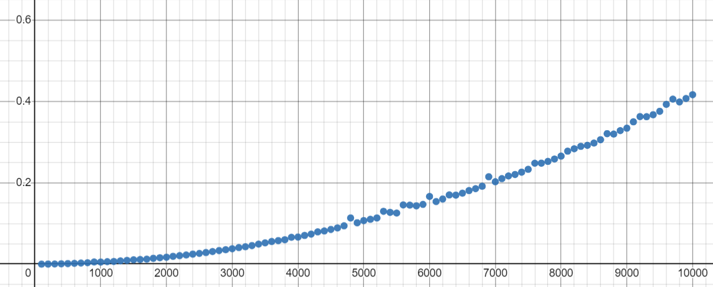
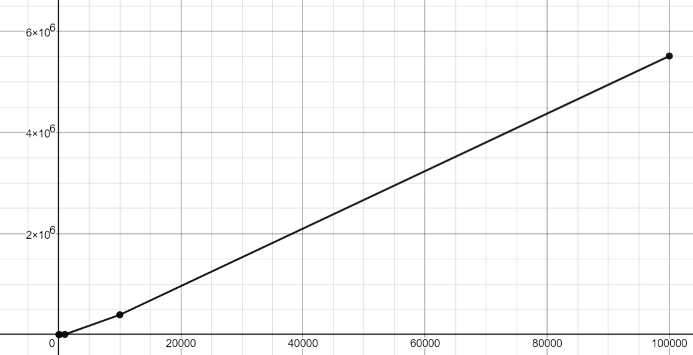

# Matrix Multiplication Vector

There are few things that can be done in this repository, they are matrix multiplication vector results by using random integers, its time complexity and also its memory usage.
## Run

Before running the algorithm, make sure to do this first:

```c
make clear
```
After that, run this code. This code will create mylib.o automatically and create main.out
```c
make main
```
Lastly, running this code will ask the user to input a number for the matrix size.
```c
./main.out
```
The program will generate random integers with the given matrix size and the results will be like this (may be varied):
```
Input N:3
M=[
4,      5,      1,
4,      5,      3,
3,      2,      1,      ]
v=[
2,
4,
3,      ]
b=[
31,
37,
17,     ]
```

## Time complexity Benchmark
Running these codes will describe the amount of computer time it takes to run an algorithm.

To see the time complexity of matrix multiplication vector, you need to do this:
```c
make time
./time.out
```
Then the program will ask the user to input a number
```
Input N:
```
Thus. it will generate random integers and run from matrix size of N to matrix size of N*100. Furthermore, it will add increment of N after the program finishes calculating previous size. 

Lastly, the program will create a file and write the results of each N called "timelist.dat" which will display the results below: (results may be varied.)
\
\
If N = 10:
```
(10,0.000002),(20,0.000002),(30,0.000003), ..., (980,0.002626),(990,0.002838),(1000,0.002753)
```
If N = 100:
```
(100,0.000059),(200,0.000229),(300,0.000504), ..., (9800,0.209936),(9900,0.216412),(10000,0.216863)
```
To make it clear for N = 100, 100, 200, and 300 mean the matrix of N size. 
\
while 0.000059, 0.000229 and 0.000504 mean how long the program will finish calculating them. 
\
This also applied on N = 10.


## Space Complexity Benchmark

This will show the total space taken by the algorithm with respect to the input size.

To check the space complexity of matrix multiplication vector, run this code below:
```c
make space
./space.out
```
The program will ask the user to input N and display this.
```
Input N: 10
press Ctrl + C to interrupt the process
```
To make it clear, the N that is inputted by the user is the matrix size. The program will calculate the matrix multiplication vector non-stop until it's interrupted.
\
While the program is running, run a new WSL terminal and type this command.
```
ps aux
```
The results will be like this (Results may be varied.):
```
USER       PID %CPU %MEM    VSZ   RSS TTY      STAT START   TIME COMMAND
root         1  0.0  0.0   2272  1528 ?        Sl   13:44   0:00 /init
root         4  0.0  0.0   2272     4 ?        Sl   13:44   0:00 plan9 --control-socket 5 --log-level 4 --server-fd 6 --pipe-fd 8 
root         7  0.0  0.0   2288   100 ?        Ss   13:44   0:00 /init
root         8  0.0  0.0   2288   108 ?        S    13:44   0:00 /init
dneilson     9  0.0  0.0   6200  5076 pts/0    Ss   13:44   0:00 -bash
root        38  0.0  0.0   2288   100 ?        Ss   13:45   0:00 /init
root        39  0.0  0.0   2288   108 ?        S    13:45   0:00 /init
dneilson    40  0.0  0.0   6072  5056 pts/1    Ss   13:45   0:00 -bash
dneilson   128 93.3  0.0   2768  1064 pts/0    R+   16:41   0:13 ./space.out
dneilson   130  0.0  0.0   7476  3108 pts/1    R+   16:41   0:00 ps aux
```
After that, you need to find the space.out's PID. As you can see, the PID for ./space.out is 128.

Then, you can use the pmap command to find the memory usage.

```
pmap <pid>
``` 
This is the results (results may be varied.):
\
If N = 10:
```
128:   ./space.out
0000563ea7b16000      4K r---- space.out
0000563ea7b17000      4K r-x-- space.out
0000563ea7b18000      4K r---- space.out
0000563ea7b19000      4K r---- space.out
0000563ea7b1a000      4K rw--- space.out
0000563ea9aac000    132K rw---   [ anon ]
00007fd80906d000     12K rw---   [ anon ]
00007fd809070000    160K r---- libc.so.6
00007fd809098000   1620K r-x-- libc.so.6
00007fd80922d000    352K r---- libc.so.6
00007fd809285000     16K r---- libc.so.6
00007fd809289000      8K rw--- libc.so.6
00007fd80928b000     52K rw---   [ anon ]
00007fd80929d000      8K rw---   [ anon ]
00007fd80929f000      8K r---- ld-linux-x86-64.so.2
00007fd8092a1000    168K r-x-- ld-linux-x86-64.so.2
00007fd8092cb000     44K r---- ld-linux-x86-64.so.2
00007fd8092d7000      8K r---- ld-linux-x86-64.so.2
00007fd8092d9000      8K rw--- ld-linux-x86-64.so.2
00007fff70341000    132K rw---   [ stack ]
00007fff703a1000     16K r----   [ anon ]
00007fff703a5000      4K r-x--   [ anon ]
 total             2768K
```
If N = 10000: (since N = 100 has almost no difference memory usage with N = 10)
```
702:   ./space.out
00005638146b8000      4K r---- space.out
00005638146b9000      4K r-x-- space.out
00005638146ba000      4K r---- space.out
00005638146bb000      4K r---- space.out
00005638146bc000      4K rw--- space.out
0000563815490000    132K rw---   [ anon ]
00007fa861b72000 390640K rw---   [ anon ]
00007fa8798ee000    160K r---- libc.so.6
00007fa879916000   1620K r-x-- libc.so.6
00007fa879aab000    352K r---- libc.so.6
00007fa879b03000     16K r---- libc.so.6
00007fa879b07000      8K rw--- libc.so.6
00007fa879b09000     52K rw---   [ anon ]
00007fa879b1b000      8K rw---   [ anon ]
00007fa879b1d000      8K r---- ld-linux-x86-64.so.2
00007fa879b1f000    168K r-x-- ld-linux-x86-64.so.2
00007fa879b49000     44K r---- ld-linux-x86-64.so.2
00007fa879b55000      8K r---- ld-linux-x86-64.so.2
00007fa879b57000      8K rw--- ld-linux-x86-64.so.2
00007ffdaaacb000    132K rw---   [ stack ]
00007ffdaaaf4000     16K r----   [ anon ]
00007ffdaaaf8000      4K r-x--   [ anon ]
 total           393396K
```
Total indicates the memory usage of the program.

## Graphs
Here's the graph for time complexity: (N = 100)

The X-Axis indicates the N (matrix size) while the Y-Axis inidicates the time taken.

Here's the plot for space complexity: (N = 10, 100, 1000, 10000, 100000)

The X-Axis indicates the matrix size or N while the Y-axis indicates the memory usage of the program in K.
